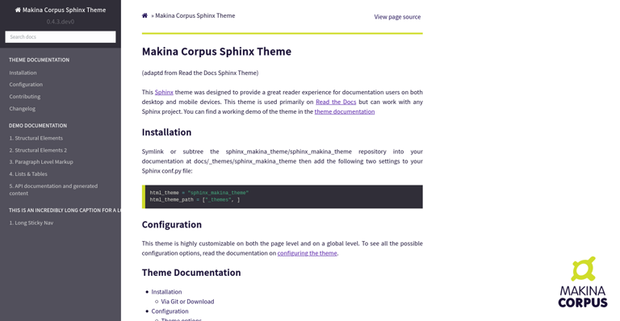

**************************
Makina Corpus Sphinx Theme
**************************
(adapted from Read the Docs Sphinx Theme)

This Sphinx_ theme was designed to provide a great reader experience for
documentation users on both desktop and mobile devices. This theme is used
primarily on `Read the Docs`_ but can work with any Sphinx project. You can find
a working demo of the theme in the `theme documentation`_

.. _Sphinx: http://www.sphinx-doc.org
.. _Read the Docs: http://www.readthedocs.org
.. _theme documentation: https://sphinx-rtd-theme.readthedocs.io/en/latest/

Aperçu
============

Installation
============

Symlink or subtree the sphinx_makina_theme/sphinx_makina_theme repository into your documentation at
docs/_themes/sphinx_makina_theme then add the following two settings to your Sphinx conf.py file:

.. code:: python

   html_theme = "sphinx_makina_theme"
   html_theme_path = ["_themes", ]

Configuration
=============

This theme is highly customizable on both the page level and on a global level.
To see all the possible configuration options, read the documentation on
`configuring the theme`_.

.. _configuring the theme: https://sphinx-rtd-theme.readthedocs.io/en/latest/configuring.html
